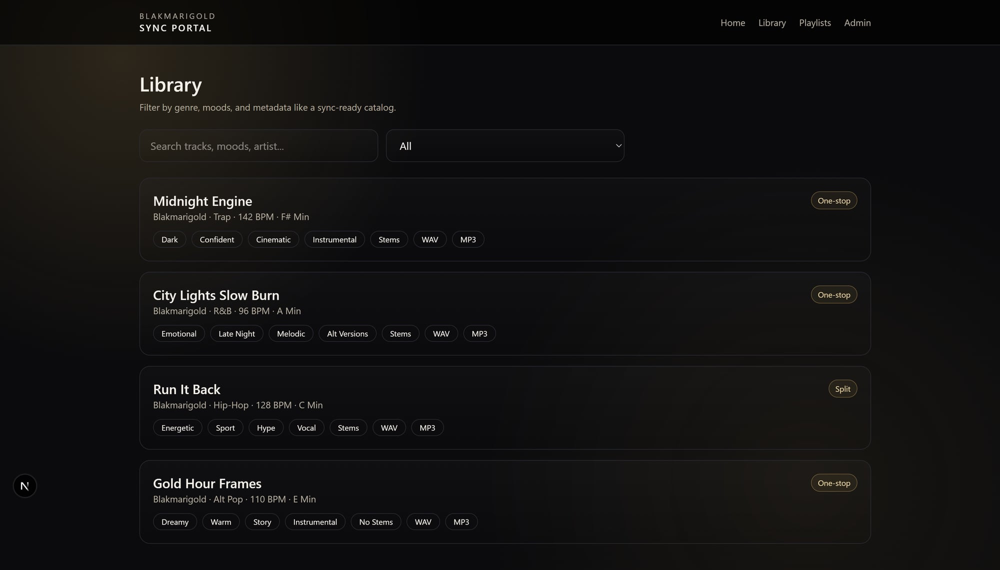
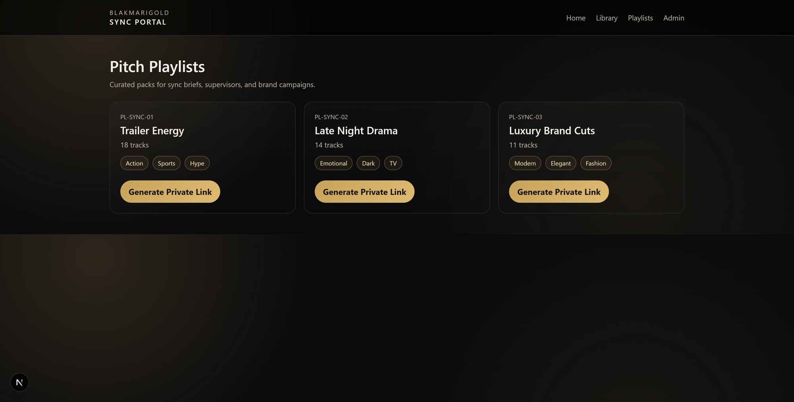
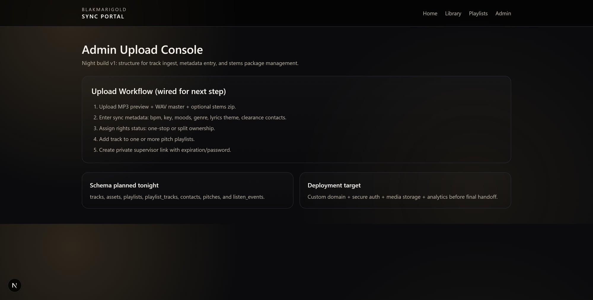

# Sync Portal

Private sync catalog and playlist-sharing portal for music pitching workflows.

Built with Next.js + TypeScript, styled UI, and a clear path to production backend integration (Supabase/S3).

## Current Features

- Home dashboard with catalog stats and pitch-focused messaging
- **Library** page with:
  - search (title, artist, mood)
  - genre filter
  - metadata display (BPM, key, mood, vocals, clearance, stems, WAV/MP3)
- **Playlists** page with curated playlist cards and private-link action placeholder
- **Admin** page that defines upload + metadata + playlist assignment workflow
- Supabase client bootstrap (`src/lib/supabase.ts`) for backend wiring

## Screenshots

### Library


### Playlists


### Admin


## Tech Stack

- Next.js 16 (App Router)
- React 19
- TypeScript
- Tailwind CSS 4
- Zod
- Supabase JS client (prepared)

## Local Development

```bash
npm install
npm run dev
```

Open: `http://localhost:3000`

## Environment Variables (for backend wiring)

Create `.env.local`:

```env
NEXT_PUBLIC_SUPABASE_URL=...
NEXT_PUBLIC_SUPABASE_ANON_KEY=...
```

## Production Roadmap (recommended)

1. **Database schema**
   - tracks, assets, playlists, playlist_tracks, contacts, pitches, listen_events
2. **Media storage (primary)**
   - AWS S3 (+ CloudFront) for MP3/WAV/stems and secure signed delivery
   - Note: vector DB is optional and only for advanced AI similarity search, not file storage
3. **Admin ingest
   - bulk CSV import for metadata
   - upload MP3/WAV/stems with validation
4. **Private sharing**
   - expiring playlist links
   - optional password protection
5. **Analytics + security**
   - event tracking (plays, downloads, shares)
   - role-based auth for admin/editor

## Deployment

- Vercel for frontend hosting
- Supabase or AWS for backend/storage
- Recommended: add CI checks (lint/build) before auto-deploy

---

If you want, next step is to wire full CRUD + upload + private link generation so this matches DISCO-style workflows end-to-end.
